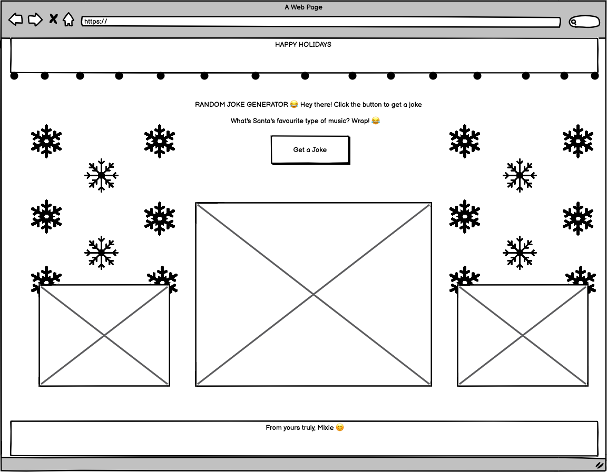

# Holiday Greeting Site

Welcome to the Holiday Greeting Site! Spread festive cheer with this customizable greeting, interactive elements, and a touch of humor. Share joy by controlling the snowfall, string of lights, and playing the holiday tune. Plus, don't forget to enjoy a good laugh with the random holiday joke generator powered by a public API.

## Table of Contents
- [Getting Started](#getting-started)
- [Features](#features)
- [Wireframe](#wireframe)
- [The Site](#the-site)
- [Technologies Used](#technologies-used)
- [Credits](#credits)

## Getting Started

To get started, simply open the Holiday Greeting Site in your web browser. Feel free to share the link with your friends and family to bring a smile to their faces.

Visit the [Holiday Greeting Site](https://mixie-png.github.io/holiday-greeting/) to share the customizable holiday greeting site.

## Features

### 1. Snowfall
Make the greeting magical with customizable snowfall. Control the intensity of the snow to create the perfect wintry atmosphere.

### 2. String of Lights
Add a festive touch to the greeting by customizing the string of lights. Choose different animations to make your holiday wishes shine.

### 3. Holiday Music
Set the mood by playing the holiday tune.

### 4. Random Holiday Joke Generator
Bringing smiles to users' faces with a touch of humor. The random holiday joke generator pulls jokes from a public API, ensuring endless laughter during the holiday season.

## Wireframe

## The Site

## Technologies Used

- HTML
- CSS
- JavaScript
- Public API for Jokes ([Joke API](https://sv443.net/jokeapi/v2/#joke-endpoint))

## Credits

- [Snowfall Effect](https://youtu.be/6x27arXNafM?si=pARbmx0siO2ZJtYr) by Online Tutorials
- [String Lights Animation #1](https://youtu.be/Hor_DqKT5F8?si=y-WXnlQqF92xKzb3) by Code Prime
- [String Lights Animation #2](https://youtu.be/u5QwqUX54ZM?si=LqgLtoOZ4hF6azJi) by ZiaCodes
- [Random Joke Generator](https://github.com/marcyvillegas/random-joke-generator?tab=readme-ov-file) by Marcy Villegas
- [Holiday Song: Background Christmas Instrumental | Christmas is Coming](https://freemusicarchive.org/music/alex-productions/single/background-christmas-instrumental-christmas-is-coming/) by artist: Alex-Productions, source: Free Music Archive, and license type: CC BY-NC

Feel free to share the joy of the holiday season! Happy coding and happy holidays! 🎄✨